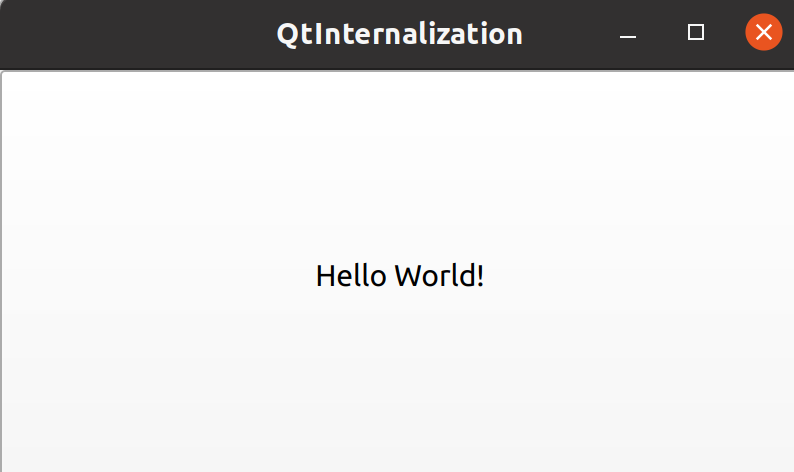
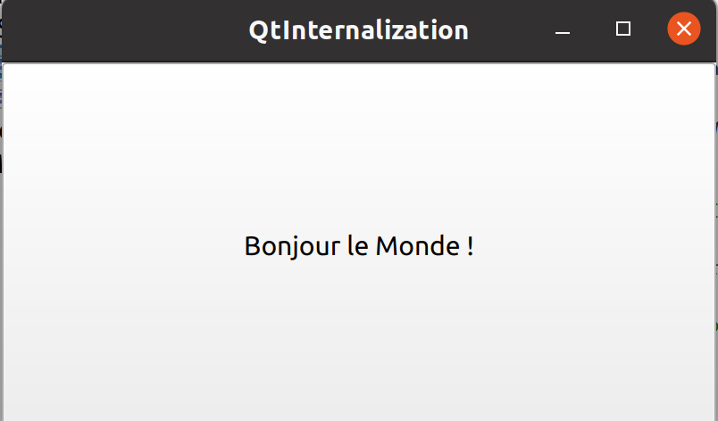

# A Simple project to demonstrate how Internalization works in Qt (with CMake)

I created a simple QLabel with a `tr` (instead of a plain `QString`)



I then used Qt Linguist to translate the ts file: very easy! The hardest part was how to launch qt linguist. I expected Qt Creator to propose it, but couldn't find that.
I located the tool at `~/Qt/6.0.3/gcc_64/bin/linguist` (using `find` command).


Then modified [main.cpp](main.cpp) to install a translator, and voilà !



## Adding another translation

I'm going to show how to do add translation for spanish for example:

1. Register a new translation file in `CMakeLists.txt`

```diff
set(TS_FILES
  translations/QtInternalization_fr_FR.ts
+ translations/QtInternalization_es_ES.ts
)
```

Now build again. That file will be created.

**Note:** this is **better** than actually copying the French one because that way Qt `linguist` will show you in the UI what you haven't translated yet.
